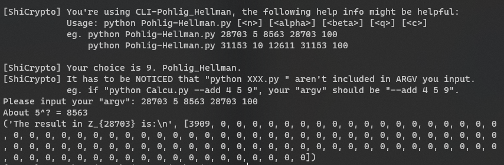

# 现代密码学 / 信息安全数学基础 辅助小工具


## 前言

> 没啥好说的。
> 一开始主要是自己写着玩，万一那天忘了咋算呢？
> 但是后来想着自己这么菜，可以用一点零碎的时间来写写看，就当练习 python 基本语法了。（赋值这些基本语法有什么练习的必要吗？）

上面这是半年前的想法。如今怎么算已经忘光了。

## 运行环境

* Python **2.7**；
  * 为什么用 2.7，这个原因很多。这个本来是可以跑在 3.8 上的。如果想继续使用 `Python 3+` 可以切换到 `master` 分支，这个分支上的代码仍旧可以运行在 `Python 3.8` 上。

## 使用

```bash
# 这里要注意，应该使用 python2 中的 pip

> pip install virtualenv
> virtualenv .venv
> .venv/Scripts/activate
> python CLI.py
```

目前的仓库将原本散乱在根目录的 `*.py` 文件放在了 `/plugin/api/src` 以及 `/plugin/api` 文件夹中。当然，也算是散乱地放在这两个文件夹里。（做了功能和接口上的简单分离（其实就是分到两个文件里去了嘛，分好之后反而感觉麻烦了））

可以像以往，在命令行中直接输入：

```bash
python ./plugin/api/Calcu.py --add 4 5 9
```

之类的指令来执行代码，也可以通过根目录下的 `CLI.py` 间接执行。



（目前输出还没有适配好，可以看到上面的输出非常地不对劲）

## 内容 / 目录

* 第 2 节：密码学基础
    * [RSA](https://github.com/skyleaworlder/ShiCrypto/blob/mastercc/plugin/api/src/RSA.py#L5)：最简单的实现
    * [ElGamal](https://github.com/skyleaworlder/ShiCrypto/blob/master/plugin/api/src/ElGamal.py#L4)：最简单的实现
    * [Morse](https://github.com/skyleaworlder/ShiCrypto/blob/master/plugin/api/src/Morse.py#L3)

* 第 4 节：整数理论
    * [最大公因数](https://github.com/skyleaworlder/ShiCrypto/blob/master/plugin/api/src/Calcu.py#L13)：辗转相除
    * [最小公倍数](https://github.com/skyleaworlder/ShiCrypto/blob/master/plugin/api/src/Calcu.py#L16)
    * [扩展欧几里得算法](https://github.com/skyleaworlder/ShiCrypto/blob/master/plugin/api/src/Calcu.py#L19)
    * [扩展欧几里得算法](https://github.com/skyleaworlder/ShiCrypto/blob/master/plugin/api/src/Calcu.py#L26)：解二元不定方程

* 第 5 节：同余式
    * [同余判断](https://github.com/skyleaworlder/ShiCrypto/blob/master/plugin/api/src/ConMod.py#L4)
    * [一次同余式求解](https://github.com/skyleaworlder/ShiCrypto/blob/master/plugin/api/src/ConMod.py#L17)
    * [中国剩余定理](https://github.com/skyleaworlder/ShiCrypto/blob/master/plugin/api/src/CRT.py#L4)

* 第 6 节：群
    * [模整数群-逆元](https://github.com/skyleaworlder/ShiCrypto/blob/master/plugin/api/src/Calcu.py#L45)

* 第 7 节：原根
    * [欧拉函数](https://github.com/skyleaworlder/ShiCrypto/blob/master/plugin/api/src/Calcu.py#L64)：定义穷举计算
    * [元素的阶](https://github.com/skyleaworlder/ShiCrypto/blob/master/plugin/api/src/Primitive.py#L9)
    * [原根性质](https://github.com/skyleaworlder/ShiCrypto/blob/master/plugin/api/src/Primitive.py#L21)
    * [原根判定充要条件](https://github.com/skyleaworlder/ShiCrypto/blob/master/plugin/api/src/Primitive.py#L33)
    * [元素幂的阶](https://github.com/skyleaworlder/ShiCrypto/blob/master/plugin/api/src/Primitive.py#L57)

* 第 8 节：二次剩余
    * [勒让德符号](https://github.com/skyleaworlder/ShiCrypto/blob/master/QuadResidue.py#L14)：欧拉判别条件
    * [雅可比符号](https://github.com/skyleaworlder/ShiCrypto/blob/master/QuadResidue.py#L21)：手动计算方式
    * [二次剩余求解](https://github.com/skyleaworlder/ShiCrypto/blob/master/Calcu.py#L58)：最傻的穷举

* 第 9 节：平方乘算法
    * [简单应用](https://github.com/skyleaworlder/ShiCrypto/blob/master/ECC.py#L122)：点的数乘

* 第 10 节：素性检测
    * [试除法](https://github.com/skyleaworlder/ShiCrypto/blob/master/PrimeTest.py#L32)
    * [Fermat 算法](https://github.com/skyleaworlder/ShiCrypto/blob/master/PrimeTest.py#L19)
    * [Miller-Rabin 算法](https://github.com/skyleaworlder/ShiCrypto/blob/master/PrimeTest.py#L41)
    * [Solovay-Strassen 算法](https://github.com/skyleaworlder/ShiCrypto/blob/master/PrimeTest.py#L60)

* 第 12 节：椭圆曲线
    * [模素数椭圆曲线-点计算](https://github.com/skyleaworlder/ShiCrypto/blob/master/ECC.py#L68)
    * [模素数椭圆曲线-点加法](https://github.com/skyleaworlder/ShiCrypto/blob/master/ECC.py#L85)
    * [模素数椭圆曲线-点数乘](https://github.com/skyleaworlder/ShiCrypto/blob/master/ECC.py#L122)
    * [模素数椭圆曲线-NAF](https://github.com/skyleaworlder/ShiCrypto/blob/master/ECC.py#L36)：给出 NAF 列表
    * [模素数椭圆曲线-ECIES](https://github.com/skyleaworlder/ShiCrypto/blob/master/ECIES.py#L14)：点压缩 / 点解压

* 第 13 节：因子分解
    * [Pollard-Rho 算法](https://github.com/skyleaworlder/ShiCrypto/blob/master/IntFactorize.py#L126)
    * [Fermat 分解法](https://github.com/skyleaworlder/ShiCrypto/blob/master/IntFactorize.py#L169)：课件未涉及，与 `Dixon 随机平方算法` 类似
    * [二次筛法](https://github.com/skyleaworlder/ShiCrypto/blob/master/IntFactorize.py#L32)：（劣等实现）

* 第 14 节：离散对数问题
    * [Shanks 算法](https://github.com/skyleaworlder/ShiCrypto/blob/master/Shanks.py#L12)
    * [Pollard-Rho 算法](https://github.com/skyleaworlder/ShiCrypto/blob/master/Pollard-Rho-Log.py#L16)
    * [PoHlig-Hellman 算法](https://github.com/skyleaworlder/ShiCrypto/blob/master/Pohlig-Hellman.py#L18)

* 第 15 节：连分数
    * [连分数展开](https://github.com/skyleaworlder/ShiCrypto/blob/master/continued.py#L27)
    * [收敛子计算](https://github.com/skyleaworlder/ShiCrypto/blob/master/continued.py#L30)
    * [Wiener Attack](https://github.com/skyleaworlder/ShiCrypto/blob/master/IntFactorize.py#L198)

* 第 16 节：多项式系数
    * [多项式系数计算](https://github.com/skyleaworlder/ShiCrypto/blob/master/MultCoef.py#L10)：包括二项式系数

## 结尾

总之，还是自娱自乐的东西吧。
